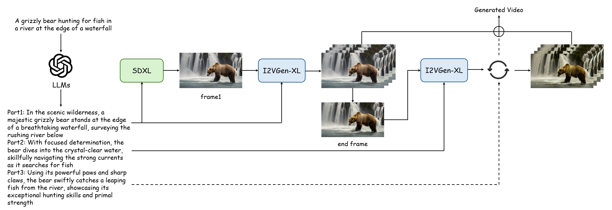

# Long_Video_Generation
>**A pipeline to generate long videos according to text prompt**  
>[Xinchen Zhang](https://cominclip.github.io/)
<br>**Tsinghua University**<br>
## Pipeline



## Gallery

<table class="center">
        <tr style="line-height: 0">
    <td width=50% style="border: none; text-align: center">A spectacular waterfall</td>
    <td width=50% style="border: none; text-align: center">A car driving down the road.</td>
    </tr>
    <tr>
    <td width=50% style="border: none"></td>
    <td width=50% style="border: none"></td>
    </tr>
</table>

<table class="center">
        <tr style="line-height: 0">
    <td width=50% style="border: none; text-align: center">Astronauts traveling in space</td>
    <td width=50% style="border: none; text-align: center">A cat looking out the window</td>
    </tr>
    <tr>
    <td width=50% style="border: none"></td>
    <td width=50% style="border: none"></td>
    </tr>
</table>

## Inference

Before inference, you need to use LLMs to obtain segmented fragments based on the prompt, along with complex descriptions of each fragment.

We provide a template in `template.txt`. Then copy and paste the template to [ChatGPT](https://chat.openai.com/), you can get the generated prompts.

We offer two ways to generate a long video. If you choose I2VGen-XL as the backbone, run:

```shell
python pipeline_i2vgenxl.py --seed 1234 --fps 16
```

If you choose SVD as the backbone, run:

```shell
python pipeline_svd.py --seed 1234 --fps 16
```

After that, we use [EMA-VFI](https://github.com/MCG-NJU/EMA-VFI) to interpolate the video.

